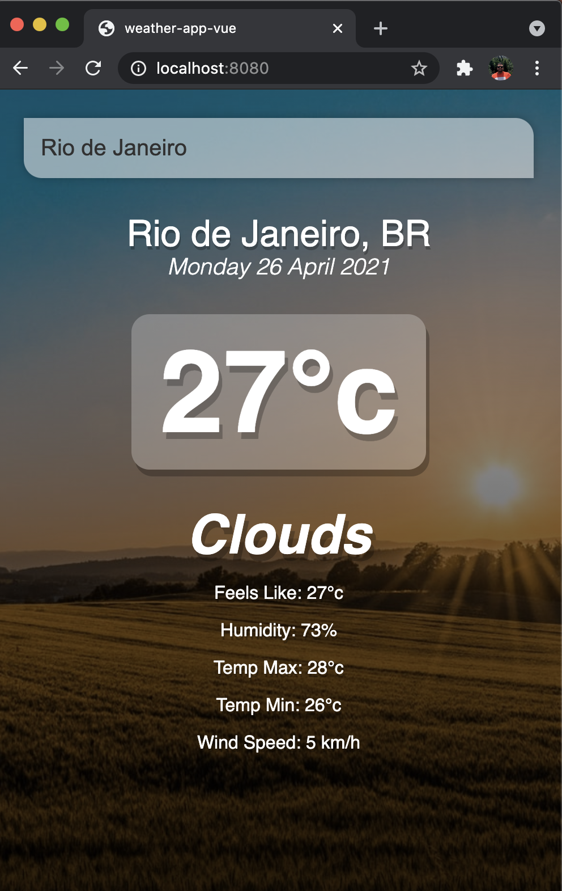
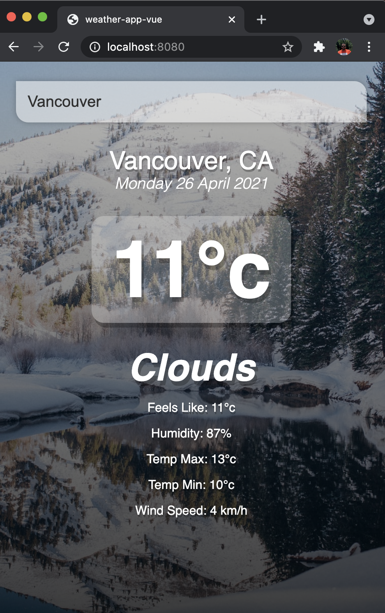

# Weather App Vue

Project carried out in VUE.js using API to show the weather in all cities in the world. I carried out this project through a video class available on the internet.

The background of the page changes according to the temperature of the city, whether it is colder or warmer.

